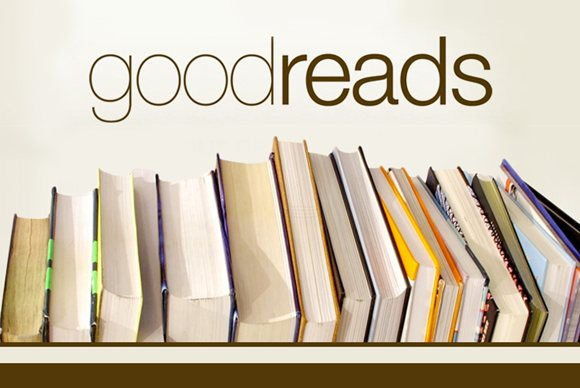
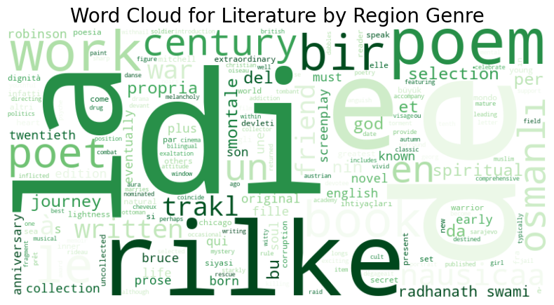

# Best Books Ever Project 📔

# **Citation**

Best books ever dataset source:

Lorena Casanova Lozano, & Sergio Costa Planells. (2020). Best Books Ever Dataset (1.0.0) [Data set]. Zenodo. https://doi.org/10.5281/zenodo.4265096

**Rights:** Creative Commons Attribution Non Commercial 4.0 International
 

**INSTRUCTIONS:**

To download original Dataset used in this project: https://zenodo.org/records/4265096
-

# Project Overview 

### Background:

Growing up, I was quite shy and introverted, finding solace in books which transported me to other worlds and allowed me to escape reality. As I grew older, my love for books never waned, and I discovered the infinite possibilities they held. As an adult, I co-founded a book club called Señoras Bien with friends, where we propose and discuss a book each month.

Inspired by this, I wondered if I could create a book recommendation system using Machine Learning to make it easier to decide what to read based on our preferences. However, before training a model, I had other analytical questions to address.

### Data Collection:

The foundation of any data analysis project is the data itself. After extensive searching and exploring multiple sources, I found a suitable dataset on Zenodo, an open-access repository. This dataset, licensed under Creative Commons Attribution Non Commercial 4.0 International, mainly comprises data scraped from GoodReads, a social cataloging website where users can track and review books. The dataset is based on the "Best Book Ever" list from GoodReads, containing information on over 52,000 books with various attributes such as page count, series, genre, and more.

### Descriptive Analysis:

I began by cleaning the data, addressing null values, and transforming data types. For example, the presence of nulls in the series variable indicated standalone books. I added features like the number of awards a book has won and handled inconsistencies in price data scraped from different sources. I visualized the distribution of numerical variables and explored genre trends and the evolution of reader preferences over time.

**SEE TABLEAU DASHBOARD:**
https://public.tableau.com/views/storysmall/THESTORYVER2?:language=en-US&:sid=&:redirect=auth&:display_count=n&:origin=viz_share_link

### Regression Models:

Regression analysis was used to understand the relationship between dependent variables ('price' and 'rating') and independent variables. I handled outliers, transformed data, and applied one-hot encoding for categorical variables. I tested three regression algorithms: Linear Regression, Decision Tree Regressor, and KNeighbors Regressor, evaluating performance using metrics like MSE, R2, and MAE. I identified key variables influencing 'rating', such as series inclusion, page count, awards, price, and user ratings.

### The Recommender:

The core feature of the project is the book recommender system. Without user-specific data, I created genre subsets and used a KNN model to recommend books similar to a user-specified favorite. The process involved:

Creating subsets for 24 general genres.
Allowing user input to specify a favorite book.
Using KNN to recommend books from the same genre with similar parameters.
The system involved extensive data preprocessing, including using a TfidfVectorizer for text descriptions and a ColumnTransformer for numerical data.

**SEE THE STREAMLIT APP WITH THE RECOMMENDER HERE:** 
https://best-books-ever-project.streamlit.app/

### Sentiment Analysis:

Finally, I performed sentiment analysis on book descriptions using NLP techniques. I aimed to see sentiment differences among genres by creating top 10 genre lists and analyzing the sentiment scores of the top 10 books in each genre. Using VADER, an NLP tool, I found that genres like "Religion and Spirituality" and "Economics" had positive sentiment scores, while "Fantasy", "Horror", and "Classics" had slightly negative scores. This analysis provided insights into the emotional tone and perception of book descriptions across genres.

WordCloud examples:

